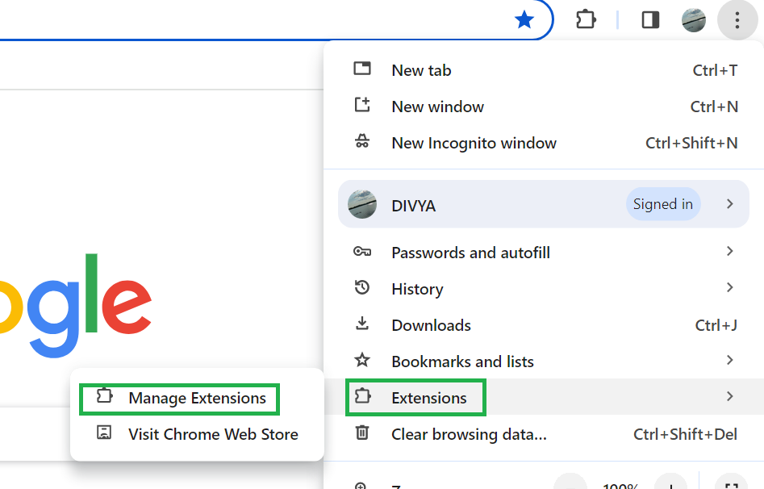

# Table of Contents
1. [Description](#description)
2. [Extension Enable](#extension_enable)
3. [Main Calendar](#main_calendar)
4. [Mini Calendar](#mini_calendar)
5. [Draggable Events](#Draggable_Events)
6. [References](#References)

---

# Description
Here, Each component is packaged as separate extensions for easy maintenance and a user-friendly organizational experience. Here we came with our application 

**FileCalendar** : Users can preview information about calendar events, drag-and-drop events for scheduling ease, and directly create, edit, or delete events. Users can get a quick overview of the month's events without navigating away from their current view. This can be especially useful when planning future events or checking availability., while a list of events enables convenient drag-and-drop functionality to the main calendar, reflecting changes in both views. If a day has already passed, the events will change color to show they're over.

--- 

# Extension_Enable
Creating a Chrome extension is quite straightforward. Here are the simplified steps.

**Setup** : Get a text editor and install Google Chrome if you haven't already.

**Create_Files** :  Make a new folder for your extension. Inside, create a file named manifest.json to define your extension's details like its name and version. Then, create HTML, CSS, and JavaScript files for your extension's functionality.

**Code_Your_Extension** : Write the code for your extension's features in the HTML, CSS, and JavaScript files you created.

 

**Test_Locally** : Open Chrome and go to  extensions and click on Manage Extension. 

 

 

Turn on ***Developer mode***. Click ***Load unpacked*** and select the folder with your extension files.
 

 

Your extension will appear in the list. Test it by interacting with it.
 

---

# Main_Calendar

- If you want to schedule an event for a specific day, just click on that day on the main calendar. You'll see options to add the event's title, description, start date, and end date. Once you've filled in the details, click on "Create Event" to add it to your calendar.

- Once the event is created, you can preview the information about the meeting by clicking on it. If you need to change the date or time, you can simply drag the event to the updated day and time.

- If you need to update any other information about the event, just click on the "Edit" button, make your changes, and click "Save."

- Each event will be highlighted by a color on the calendar, making it easy to see at a glance when you have appointments or commitments.

- We've added a visual indicator for past events. After both the event day and scheduled time have passed, the event block's appearance changes, signaling that it's already happened. This "grid off" status assists users in promptly recognizing completed events, streamlining their focus on upcoming or ongoing ones.

- And if you decide you no longer need an event, simply click on it and then click "Delete" to remove it from your calendar.

- If you want to create an event that repeats weekly, you have the option to customize which days of the week the event occurs on. We've implemented a checkbox system where you can simply check the box next to the days you want the event to be recreated. This gives you flexibility and control over your recurring events, allowing you to tailor them to your specific needs.

- This way, managing your schedule is easy and intuitive, allowing you to stay organized and on top of your commitments.

--- 

# Mini_Calendar

The small calendar is like a mini version of your whole month's schedule. It lets you quickly check what's coming up without leaving your current view. It's great for planning future events or seeing when you're free.  This way, you can stay on top of your schedule and never miss a thing.
 

--- 

# Draggable_Events

- Here, You can create draggable events for things like meetings with your professors, team meetings, project meeting, or presentations for your final year project. These events are like virtual sticky events that you can easily move around on your calendar to schedule them at different times. 
- If you have no gatherings longer need an event or want to reschedule it, you can simply drag it to a new time slot or delete it after dropping it on the Main calendar. There's an option to enable a checkbox for "remove after drop," which automatically removes the event from its original position after you drop it onto the Main calendar.
- you drag one of these events onto your main calendar, it shows up as a colored pop or a highlighted block in both calendars as well. 
- This visual representation helps you manage your time effectively and stay organized amidst your busy schedule.

 

 

--- 

# References

- [fullcalender](https://fullcalendar.io)  
- [jQuery UI](http://jqueryui.com)

